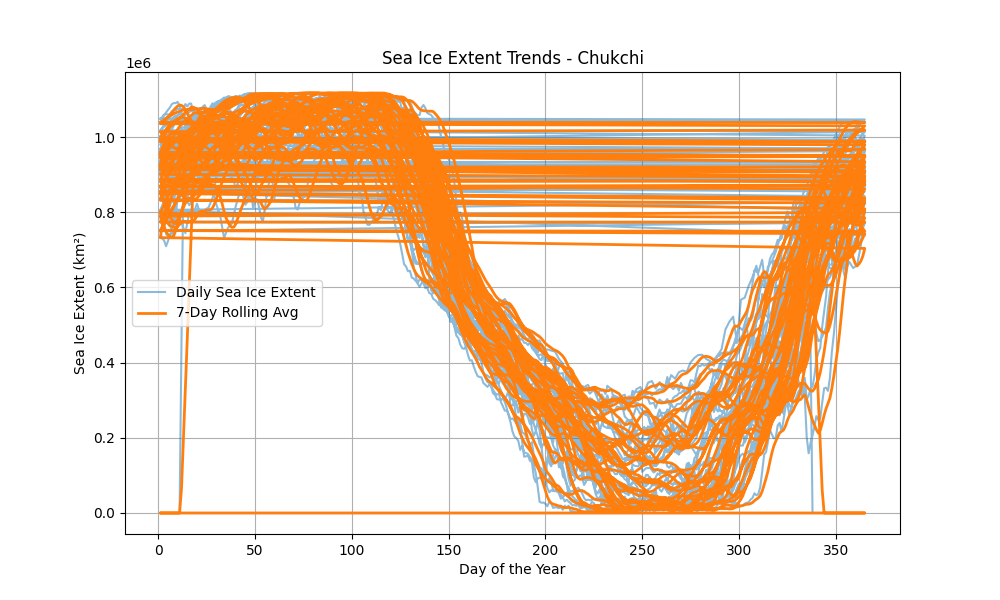
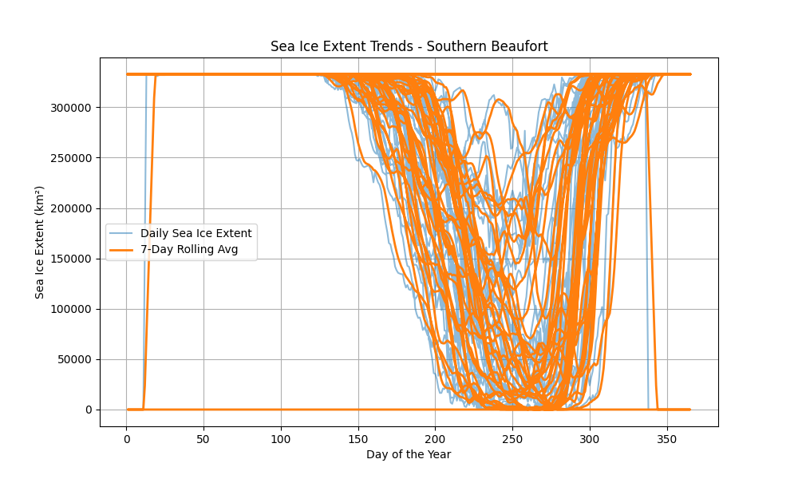
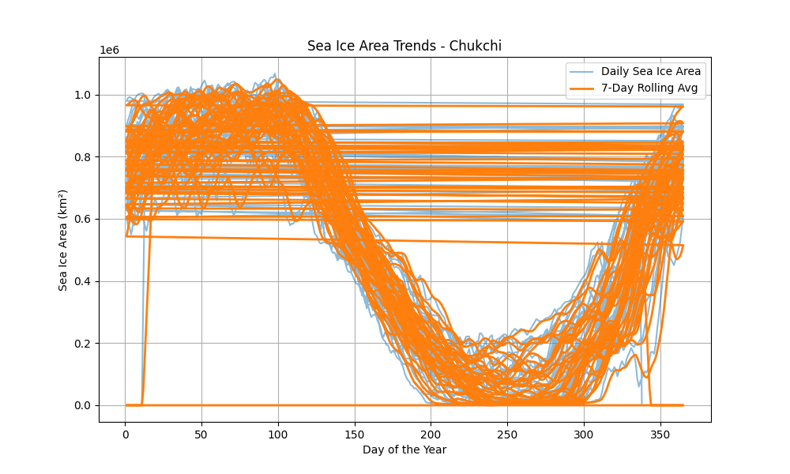
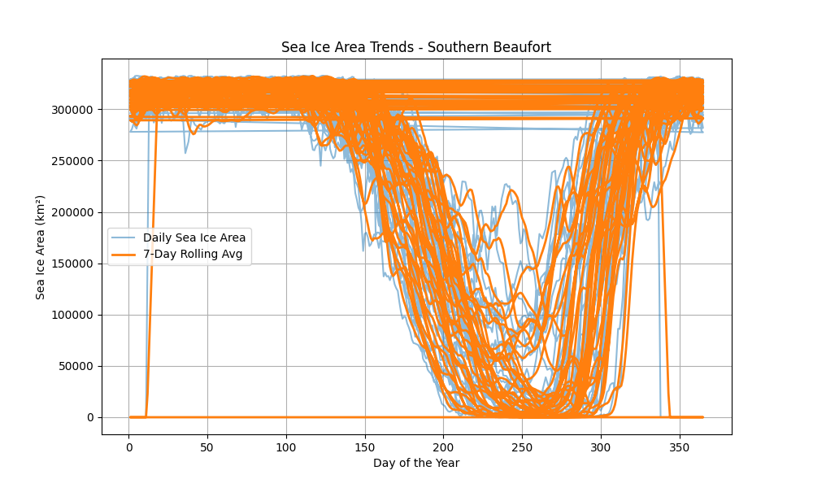
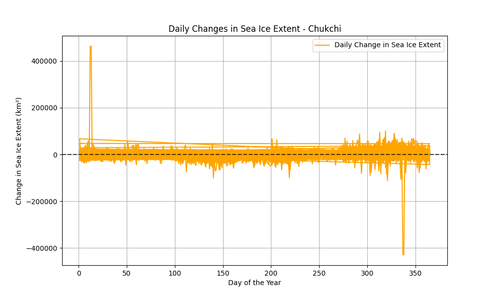
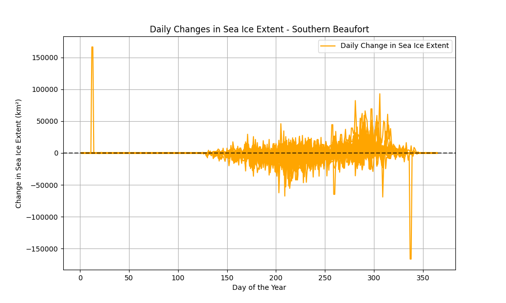

# Results Analysis

This document provides an analysis of the predictive modeling results obtained from the trained model. Key metrics include Mean Squared Error (MSE), Mean Absolute Error (MAE), and R² (R-Squared).

---

## Evaluation Metrics

1. **Mean Squared Error (MSE)**: `79,640,751.46`
   - **Interpretation**: MSE measures the average squared difference between predicted and actual values. A lower MSE is better. 
   - While the value appears large, it is in the context of sea ice extent measured in square kilometers. Given the scale of the data, this result may be reasonable.

2. **Mean Absolute Error (MAE)**: `3,568.27`
   - **Interpretation**: MAE represents the average magnitude of errors in the predictions. In this case, the predictions are off by approximately 3,568 km² on average, which is relatively small compared to the total sea ice extent.

3. **R² (R-Squared)**: `1.00`
   - **Interpretation**: An R² of 1.00 indicates that the model explains all variability in the data perfectly. While this seems ideal, it raises concerns about overfitting.

---

## Visualizations

### 1. Sea Ice Extent Trends
The visualizations below display daily sea ice extent along with smoothed 7-day rolling averages for each region.

#### **Chukchi Sea**

#### **Southern Beaufort Sea**

---

### 2. Sea Ice Area Trends
These plots show daily sea ice area with corresponding rolling averages for trend analysis.

#### **Chukchi Sea**

#### **Southern Beaufort Sea**

---

### 3. Daily Changes in Sea Ice Extent
The following visualizations highlight day-to-day changes in sea ice extent for both regions.

#### **Chukchi Sea**

#### **Southern Beaufort Sea**

---

## Evaluation and Recommendations

### 1. **Understanding the Metrics**:
   - **MSE**: While the MSE value is high, it is proportional to the scale of the data.  It is expected to be large given the target variable represents sea ice extent in square kilometers, which spans hundreds of thousands.
   - **MAE**: The MAE is much smaller relative to the overall scale of the target variable, suggesting reasonable accuracy in the model's predictions.
   - **R² of 1.00**: Although this is an ideal score, it may indicate overfitting, where the model has learned the training data too well but may not generalize effectively to unseen data.

---

### 2. **Signs of Overfitting**:
   - An R² of 1.00 suggests the possibility of overfitting, particularly if:
     - The test set is small or not representative.
     - The model is too complex (e.g., Random Forest with many deep trees).
   - **Solution**: Use techniques like cross-validation, hyperparameter tuning, and limiting tree depth in the Random Forest.

---

### 3. **Comparison with a Baseline Model**:
   - Establish a baseline using simple models such as:
     - Predicting the mean value of sea ice extent.
     - Predicting the previous day's value.
   - Compare the MSE, MAE, and R² metrics of your Random Forest model with the baseline. A significant improvement would validate the model's performance.

---

### 4. **Real-World Forecasting**:
   - Extend the evaluation to time series forecasting:
     - Predict future values (e.g., the next 30 days or year).
     - Assess how well the model generalizes to real-world scenarios beyond the training data.

---

### 5. **Further Recommendations**:
   - Include additional features or external data (e.g., temperature, atmospheric conditions) to improve model accuracy.
   - Visualize errors and patterns to identify where the model performs poorly and optimize accordingly.

---

## Summary

The model demonstrates promising results, with a low MAE relative to the data scale and a perfect R² score. However, the high MSE and perfect R² suggest overfitting may be an issue. Incorporating the above recommendations, such as using cross-validation and baseline comparisons, will ensure robust evaluation and improved generalization.

## Visualization Directory

All visualizations are saved in the `visualizations/` directory of this project:
1. **Sea Ice Extent Trends**:
   - `visualizations/Chukchi_sea_ice_extent_trend.png`
   - `visualizations/Southern_Beaufort_sea_ice_extent_trend.png`
2. **Sea Ice Area Trends**:
   - `visualizations/Chukchi_sea_ice_area_trend.png`
   - `visualizations/Southern_Beaufort_sea_ice_area_trend.png`
3. **Daily Changes in Sea Ice Extent**:
   - `visualizations/Chukchi_sea_ice_extent_diff.png`
   - `visualizations/Southern_Beaufort_sea_ice_extent_diff.png`

For detailed trend analysis, refer to these visualizations.